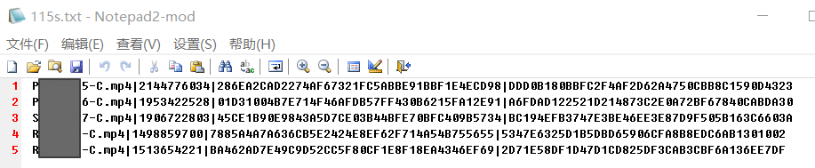
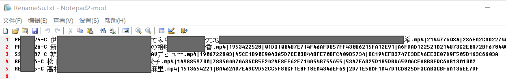

# 115_Code_Rename
修改自项目<a title="Hits" target="_blank" href="https://github.com/yoshiko2/AV_Data_Capture"> AV Data Capture (CLI) </a>

工具的初衷是：为<a title="Fake115Upload" target="_blank" href="https://github.com/T3rry7f/Fake115Upload">Fake115Upload</a>生成的**日本电影115转存码批量自动重命名。**

处理115转存码，识别番号，按规则重命名。重命名后的码转存到网盘后，文件名是完整的，**间接为网盘文件重命名**。  
也可以对转存码**分类、抓取影片封面图、元数据**。

# 下载

[Windows版](https://github.com/LSD08KM/115_Code_Rename/releases)

其他系统请clone源码包运行，并手动安装Python3环境

# 如何使用

## 注意事项，必读！

工具要处理的文本文档如下图所示：



文件内每行一条转存码，转存码的开头是文件名。

旧文件名必须满足<a title="Hits" target="_blank" href="https://github.com/yoshiko2/AV_Data_Capture"> AV Data Capture (CLI) </a>的条件：文件名中间要有下划线或者减号"_","-"，没有多余的内容只有番号为最佳。

默认将重命名失败的码保存在`115failed.txt` ，   
成功的码保存在AV_output文件夹内的`RenameSu.txt`。

重命名后的文档如下：



## 简要教程:

1. 把软件和写有115转存码的文本文档放到同一目录
2. 修改config.ini参数，把input_file=后的文件名改成要处理的文件
3. 设置 config.ini 文件的代理（路由器拥有自动代理功能的可以把 proxy= 后面内容去掉）
4. 运行软件等待完成

**详细请看以下完整文档**

# 完整使用文档

## 模块安装
如果运行**源码**版，运行前请安装**Python环境**和安装以下**模块**  

在终端 cmd/Powershell/Terminal 中输入以下代码来安装模块

```python
pip install requests pyquery lxml Beautifulsoup4 pillow
```

## 配置文件config.ini
### 配置文件的参数
```
[common]
运行模式：
main_mode=21	
输入文档(要处理的文档)：
input_file=115s.txt	
保存重命名失败的转存码的文档：
failed_output_file=115failed.txt	
保存重命名成功的转存码的文件夹
success_output_folder=AV_output	
没用，不要修改：
soft_link=0

网络设置：
[proxy]
代理设置：
proxy=socks5://127.0.0.1:10808
连接超时重试：
timeout=5
连接重试次数：
retry=2

重命名规则：
[Name_Rule]
自定义目录：
location_rule= year+'/'+studio 
命名规则：
naming_rule=number+' '+actor+' '+title

没用，不要修改：
[update]
update_check=0

没用，不要修改：
[escape]
literals=\()/
folders=AV_output

调试模式：
[debug_mode]
switch=0
```

### 运行模式

```
[common]
main_mode=11
```
11 转存码存到输出目录下的单一文档  
12 转存码存到输出目录下的单一文档，并下载封面图  
13 转存码存到输出目录下的单一文档，并下载全部图片及元数据文件  
21 转存码按目录结构规则分类  
22 转存码按目录结构规则分类，并下载封面图  
23 转存码按目录结构规则分类，并下载全部图片及元数据文件 

---
### 设置输入文档、失败输出文档和成功输出目录

```
input_file=115s.txt	
failed_output_file=115failed.txt	
success_output_folder=AV_output	
```
---
### 网络设置
```
[proxy]  
proxy=127.0.0.1:1081  
timeout=10  
retry=3
```
#### 针对某些地区的代理设置
```
proxy=127.0.0.1:1081  
```

打开```config.ini```,在```[proxy]```下的```proxy```行设置本地代理地址和端口，支持Shadowxxxx/X,V2XXX本地代理端口  
素人系列抓取建议使用日本代理  
**路由器拥有自动代理功能的可以把proxy=后面内容去掉**  
**本地代理软件开全局模式的用户同上**  
**如果遇到tineout错误，可以把文件的proxy=后面的地址和端口删除，并开启代理软件全局模式，或者重启电脑，代理软件，网卡**  

---
#### 连接超时重试设置
```
timeout=10  
```
10为超时重试时间 单位：秒

---
#### 连接重试次数设置
```
retry=3  
```
3即为重试次数

---
### 设置目录结构规则和影片重命名规则

默认配置：

```
[Name_Rule]
location_rule= year+'/'+studio 
naming_rule=number+' '+actor+' '+title
```
#### 命名参数
```
title = 片名
actor = 演员
studio = 公司
director = 导演
release = 发售日
year = 发行年份
number = 番号
cover = 封面链接
tag = 类型
outline = 简介
runtime = 时长
```

上面的参数以下都称之为**变量**

#### 例子：
自定义规则方法：有两种元素，变量和字符，无论是任何一种元素之间连接必须要用加号 **+** ，比如：```'naming_rule=['+number+']-'+title```，其中冒号 ' ' 内的文字是字符，没有冒号包含的文字是变量，元素之间连接必须要用加号 **+** 

**目录结构规则：**通过文件夹结构实现分类。默认 ```location_rule= year+'/'+studio ```。
**不推荐修改时在这里添加 title**，有时 title 过长，因为 Windows API 问题，抓取数据时新建文件夹容易出错。

**影片命名规则：**默认 ```naming_rule=number+'-'+title```

---
### 调试模式
```
[debug_mode]
switch=1  
```

如要开启调试模式，请手动输入以上代码到```config.ini```中，开启后可在抓取中显示影片元数据

---

## 多集影片处理

可以把多集电影按照集数后缀命名为类似`ssni-xxx-cd1.mp4m,ssni-xxx-cd2.mp4，abp-xxx-CD1.mp4`的规则，只要含有`-CDn./-cdn.`类似命名规则，即可使用分集功能

## 中文字幕处理

当文件名包含: 中文，字幕，-c., -C., 会在番号后添加-C后缀。

处理元数据时会加上**中文字幕**标签。

## 旧文件处理

当该目录存在以前的输出文档或文件夹，例如`115failed.txt`或`AV_output`文件夹。会将旧文件重命名，例如`AV_output_20200411170755`，以防文件混乱。

